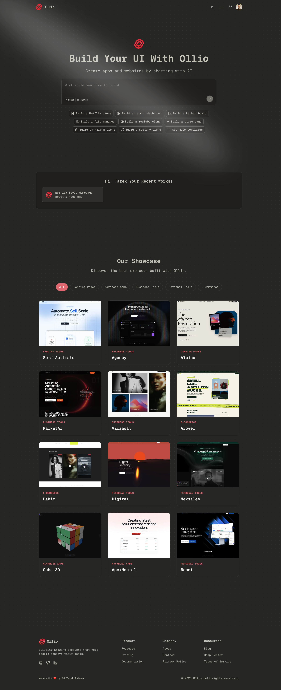
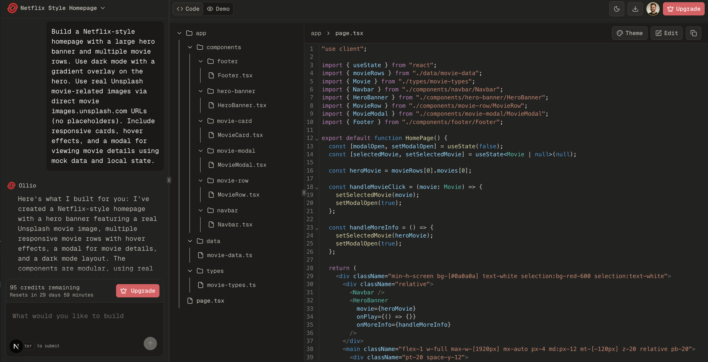
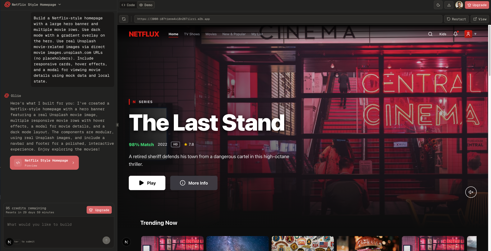
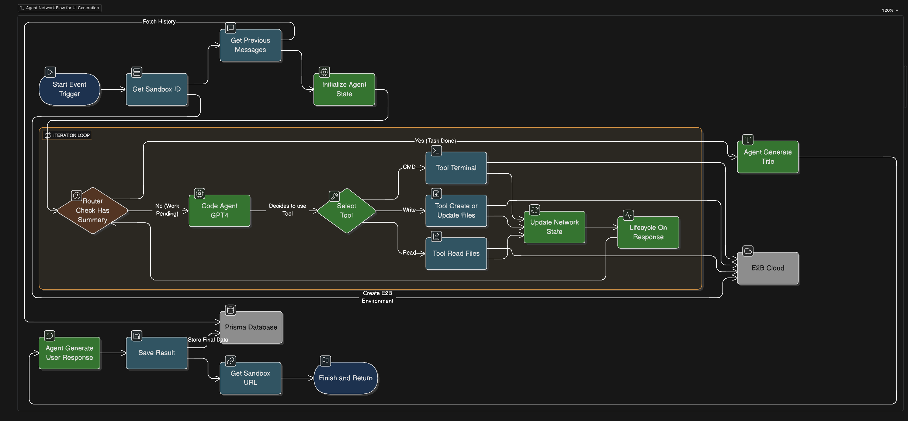
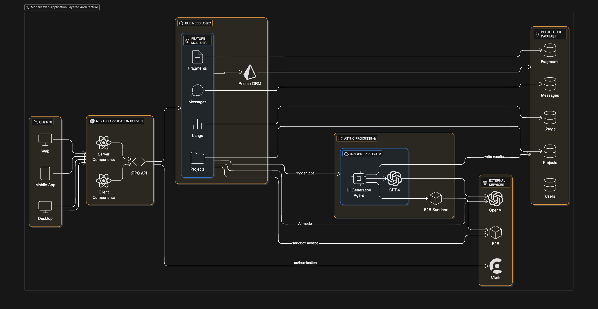
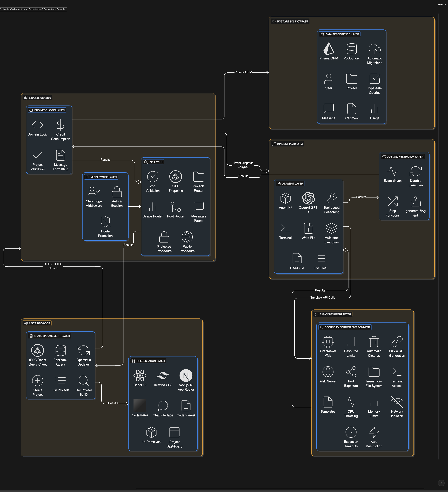
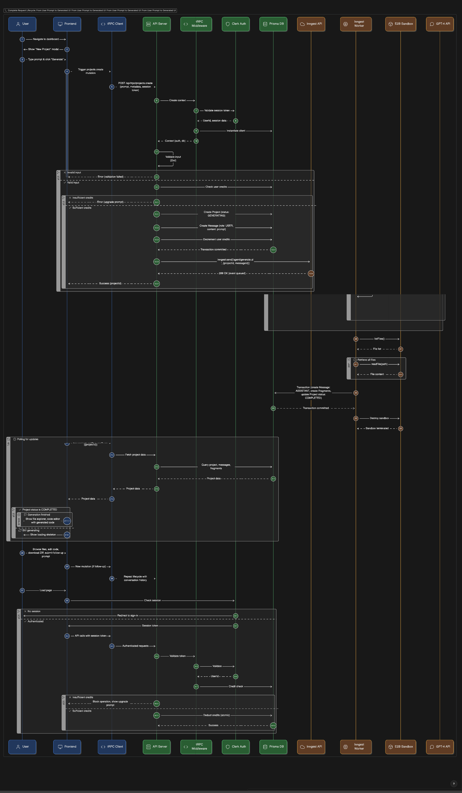

# Ollio AI - AI-Powered UI Generation Platform

Ollio AI is a sophisticated full-stack web application that enables users to generate user interface components through natural language prompts. The platform leverages cutting-edge AI technology to transform text descriptions into fully functional, production-ready React components with proper styling and interactivity.

### Core Capabilities

**AI-Powered Code Generation**: Users describe the UI they want in plain English, and the system generates complete React components with Tailwind CSS styling.

**Secure Sandbox Execution**: All generated code runs in isolated cloud environments, ensuring security and preventing any impact on the main application infrastructure.

**Real-Time Collaboration**: The system supports conversational interactions where users can iteratively refine their generated components through follow-up prompts.

**Project Management**: Users can manage multiple UI generation projects, with full version history and the ability to export generated code.

**Usage Tracking**: Built-in credit system to manage and monitor API usage and generation costs.


## Table of Contents
1. [Project Overview](#project-overview)
2. [Technology Stack](#technology-stack)
3. [Architecture Philosophy](#architecture-philosophy)
4. [Project Structure](#project-structure)
5. [Data Flow & System Architecture](#data-flow--system-architecture)
6. [Core Components Deep Dive](#core-components-deep-dive)
7. [The AI Agent Workflow](#the-ai-agent-workflow)
8. [Database Schema](#database-schema)
9. [API Layer Architecture](#api-layer-architecture)
10. [Frontend Architecture](#frontend-architecture)
11. [Background Job Processing](#background-job-processing)
12. [Security & Authentication](#security--authentication)
13. [Deployment Considerations](#deployment-considerations)


---

## Screenshots

### 🏠 Home


### 💻 Code


### 🚀 Demo


## High-Level Architecture Overview

### Agent Network Flow For UI Generation Architecture 



### System Architecture Diagram (Conceptual)

The Ollio AI platform is built on a **layered, service-oriented architecture** with clear separation of concerns:



### Architectural Principles

**Separation of Concerns**: Each layer has a distinct responsibility. The presentation layer handles user interaction, the application layer processes requests, the business logic layer contains domain-specific rules, and the data layer manages persistence.

**Loose Coupling Through Events**: The synchronous API layer and asynchronous job processing layer communicate through events rather than direct calls. This allows the API to respond immediately while expensive operations continue in the background.

**Type Safety Across Boundaries**: TypeScript types flow from the database schema (via Prisma) through the business logic and API layer (via tRPC) to the frontend components, ensuring consistency across the entire stack.

**Modularity and Scalability**: The business logic is organized into feature-based modules rather than technical layers, making it easy to understand, maintain, and scale specific features independently.

**Security Through Isolation**: Generated code executes in completely isolated sandbox environments that are destroyed after use, preventing any security risks to the main application or other users.

---

### Detailed Architectural

The application follows a **microservices-inspired monolithic architecture** where concerns are cleanly separated into layers, but all run within the same deployment for simplicity and reduced latency.




#### explaination :

```
┌─────────────────────────────────────────────────────────────────────────────┐
│                              USER BROWSER                                    │
│  ┌────────────────────────────────────────────────────────────────────────┐ │
│  │                    PRESENTATION LAYER (React)                          │ │
│  │  • Next.js 16 App Router (Server & Client Components)                 │ │
│  │  • React 19 with Suspense & Error Boundaries                          │ │
│  │  • Tailwind CSS for styling                                           │ │
│  │  • CodeMirror for syntax highlighting                                 │ │
│  │                                                                        │ │
│  │  Components:                                                          │ │
│  │  ├─ Chat Interface (src/app/projects/[projectId]/page.tsx)           │ │
│  │  ├─ Code Viewer (src/components/code-view/)                          │ │
│  │  ├─ Project Dashboard (src/app/projects/page.tsx)                    │ │
│  │  └─ UI Primitives (src/components/ui/)                               │ │
│  └────────────────────────────────────────────────────────────────────────┘ │
│                                    ↓ ↑                                       │
│  ┌────────────────────────────────────────────────────────────────────────┐ │
│  │                    STATE MANAGEMENT LAYER                              │ │
│  │  • tRPC React Query Client (Type-safe hooks)                          │ │
│  │  • TanStack Query for caching & synchronization                       │ │
│  │  • Optimistic updates & automatic refetching                          │ │
│  │                                                                        │ │
│  │  Hooks:                                                               │ │
│  │  ├─ api.projects.create.useMutation()                                │ │
│  │  ├─ api.projects.getById.useQuery()                                  │ │
│  │  └─ api.projects.list.useQuery()                                     │ │
│  └────────────────────────────────────────────────────────────────────────┘ │
└─────────────────────────────────────────────────────────────────────────────┘
                                      ↓ ↑
                               HTTP/HTTPS (tRPC Protocol)
                                      ↓ ↑
┌─────────────────────────────────────────────────────────────────────────────┐
│                          NEXT.JS SERVER (Node.js)                            │
│  ┌────────────────────────────────────────────────────────────────────────┐ │
│  │                      MIDDLEWARE LAYER                                  │ │
│  │  • Clerk Edge Middleware (src/proxy.ts)                               │ │
│  │  • Request authentication & authorization                             │ │
│  │  • Route protection (public vs. protected)                            │ │
│  │  • Session management                                                 │ │
│  │                                                                        │ │
│  │  Flow:                                                                │ │
│  │  Request → Check Auth → Allow/Redirect → Next Handler                │ │
│  └────────────────────────────────────────────────────────────────────────┘ │
│                                    ↓                                         │
│  ┌────────────────────────────────────────────────────────────────────────┐ │
│  │                      API LAYER (tRPC)                                  │ │
│  │  • Type-safe RPC endpoints (src/trpc/routers/)                        │ │
│  │  • Input validation with Zod schemas                                  │ │
│  │  • Business logic orchestration                                       │ │
│  │  • Error handling & transformation                                    │ │
│  │                                                                        │ │
│  │  Routers:                                                             │ │
│  │  ├─ projectsRouter (CRUD operations)                                 │ │
│  │  ├─ messagesRouter (Chat history)                                    │ │
│  │  ├─ usageRouter (Credit tracking)                                    │ │
│  │  └─ Root Router (_app.ts - combines all)                             │ │
│  │                                                                        │ │
│  │  Procedures:                                                          │ │
│  │  ├─ protectedProcedure (requires auth)                               │ │
│  │  └─ publicProcedure (open access)                                    │ │
│  └────────────────────────────────────────────────────────────────────────┘ │
│                                    ↓                                         │
│  ┌────────────────────────────────────────────────────────────────────────┐ │
│  │                    BUSINESS LOGIC LAYER                                │ │
│  │  • Domain-specific logic (src/modules/)                               │ │
│  │  • Credit consumption (src/lib/usage.ts)                              │ │
│  │  • Project validation                                                 │ │
│  │  • Message formatting                                                 │ │
│  └────────────────────────────────────────────────────────────────────────┘ │
└─────────────────────────────────────────────────────────────────────────────┘
                                      ↓ ↑
                            PostgreSQL Connection Pool
                                      ↓ ↑
┌─────────────────────────────────────────────────────────────────────────────┐
│                      POSTGRESQL DATABASE                                     │
│  ┌────────────────────────────────────────────────────────────────────────┐ │
│  │                    DATA PERSISTENCE LAYER                              │ │
│  │  • Prisma ORM (prisma/schema.prisma)                                  │ │
│  │  • Connection pooling with PgBouncer                                  │ │
│  │  • Automatic migrations                                               │ │
│  │  • Type-safe query building                                           │ │
│  │                                                                        │ │
│  │  Tables:                                                              │ │
│  │  ├─ User (Authentication data)                                        │ │
│  │  ├─ Project (UI generation projects)                                 │ │
│  │  ├─ Message (Chat history: USER ↔ ASSISTANT)                         │ │
│  │  ├─ Fragment (Generated code files)                                  │ │
│  │  └─ Usage (Credit tracking)                                          │ │
│  └────────────────────────────────────────────────────────────────────────┘ │
└─────────────────────────────────────────────────────────────────────────────┘
                                      ↓
                         Event Dispatch (Async)
                                      ↓
┌─────────────────────────────────────────────────────────────────────────────┐
│                    INNGEST (Background Job Platform)                         │
│  ┌────────────────────────────────────────────────────────────────────────┐ │
│  │                    JOB ORCHESTRATION LAYER                             │ │
│  │  • Event-driven architecture                                          │ │
│  │  • Durable execution with retries                                     │ │
│  │  • Step functions for complex workflows                               │ │
│  │  • Built-in observability                                             │ │
│  │                                                                        │ │
│  │  Functions:                                                           │ │
│  │  └─ generateUIAgent (src/inngest/functions.ts)                       │ │
│  │     ├─ Step 1: Create sandbox                                        │ │
│  │     ├─ Step 2: Initialize AI agent                                   │ │
│  │     ├─ Step 3: Run generation                                        │ │
│  │     ├─ Step 4: Save results                                          │ │
│  │     └─ Step 5: Cleanup sandbox                                       │ │
│  └────────────────────────────────────────────────────────────────────────┘ │
│                                    ↓                                         │
│  ┌────────────────────────────────────────────────────────────────────────┐ │
│  │                    AI AGENT LAYER                                      │ │
│  │  • @inngest/agent-kit (Agent framework)                               │ │
│  │  • OpenAI GPT-4 (Language model)                                      │ │
│  │  • Tool-based reasoning                                               │ │
│  │  • Multi-step execution                                               │ │
│  │                                                                        │ │
│  │  Agent Capabilities:                                                  │ │
│  │  ├─ Natural language understanding                                    │ │
│  │  ├─ Code generation (HTML, CSS, JS)                                  │ │
│  │  ├─ File system operations                                           │ │
│  │  ├─ Terminal command execution                                       │ │
│  │  └─ Multi-turn reasoning                                             │ │
│  │                                                                        │ │
│  │  Tools Available to Agent:                                           │ │
│  │  ├─ terminal: Run shell commands                                     │ │
│  │  ├─ writeFile: Create/update files                                   │ │
│  │  ├─ readFile: Read file contents                                     │ │
│  │  └─ listFiles: Directory listing                                     │ │
│  └────────────────────────────────────────────────────────────────────────┘ │
└─────────────────────────────────────────────────────────────────────────────┘
                                      ↓
                              Sandbox API Calls
                                      ↓
┌─────────────────────────────────────────────────────────────────────────────┐
│                    E2B CODE INTERPRETER (Cloud Sandbox)                      │
│  ┌────────────────────────────────────────────────────────────────────────┐ │
│  │                    SECURE EXECUTION ENVIRONMENT                        │ │
│  │  • Isolated Linux containers (Firecracker VMs)                        │ │
│  │  • Resource limits (CPU, memory, network)                             │ │
│  │  • Automatic cleanup after execution                                  │ │
│  │  • Public URL generation for previews                                 │ │
│  │                                                                        │ │
│  │  Features:                                                            │ │
│  │  ├─ File System: In-memory workspace                                 │ │
│  │  ├─ Terminal: Full bash shell access                                 │ │
│  │  ├─ Web Server: Serve generated HTML/CSS/JS                          │ │
│  │  ├─ Port Exposure: Public URLs for iframe embedding                  │ │
│  │  └─ Templates: Pre-configured environments (Next.js, React, etc.)    │ │
│  │                                                                        │ │
│  │  Security Measures:                                                   │ │
│  │  ├─ Network isolation (no outbound access)                           │ │
│  │  ├─ CPU throttling                                                    │ │
│  │  ├─ Memory limits (512MB - 2GB)                                      │ │
│  │  ├─ Execution timeouts (30s - 5min)                                  │ │
│  │  └─ Automatic destruction after use                                  │ │
│  └────────────────────────────────────────────────────────────────────────┘ │
└─────────────────────────────────────────────────────────────────────────────┘
```

---

### Complete Flow Visualization
```
[USER ACTION]
    │
    ├─→ Phase 1: Browser (0-50ms)
    │   ├─ Form submission
    │   ├─ Validation
    │   └─ Optimistic UI update
    │
    ├─→ Phase 2: Network (50-150ms)
    │   ├─ TLS handshake
    │   ├─ HTTP/2 connection
    │   └─ Request transmission
    │
    ├─→ Phase 3: Middleware (150-200ms)
    │   ├─ Authentication check
    │   ├─ Session validation
    │   └─ Route protection
    │
    ├─→ Phase 4: API Layer (200-250ms)
    │   ├─ Input validation
    │   ├─ Credit check
    │   ├─ Database write #1 (USER message)
    │   └─ Inngest dispatch
    │
    ├─→ Phase 5: Response (250-300ms)
    │   ├─ Success response
    │   ├─ UI confirmation
    │   └─ Start polling
    │
    ├─→ Phase 6: Background (Async, 10-60s)
    │   ├─ Inngest picks up job
    │   ├─ Create sandbox
    │   ├─ Initialize AI agent
    │   ├─ Generate code
    │   ├─ Extract files
    │   └─ Database write #2 (ASSISTANT message)
    │
    ├─→ Phase 7: Polling (Every 2s)
    │   ├─ Check for new messages
    │   ├─ Detect ASSISTANT message
    │   └─ Trigger UI update
    │
    └─→ Phase 8: Display (Final)
        ├─ Show AI response
        ├─ Render code tabs
        └─ Load preview iframe

[RESULT DISPLAYED]
```

### Multi-Layer Security Architecture

```
┌─────────────────────────────────────────────────────────────┐
│  LAYER 1: Edge Middleware (src/proxy.ts)                    │
│  • Runs on Cloudflare Edge                                  │
│  • Checks every request before it reaches the server        │
│  • Validates Clerk session tokens                           │
│  • Redirects unauthenticated users                          │
└─────────────────────────────────────────────────────────────┘
                          ↓ (if authenticated)
┌─────────────────────────────────────────────────────────────┐
│  LAYER 2: tRPC Protected Procedures                         │
│  • Validates user has active session                        │
│  • Checks user permissions                                  │
│  • Ensures user can only access their own data              │
└─────────────────────────────────────────────────────────────┘
                          ↓
┌─────────────────────────────────────────────────────────────┐
│  LAYER 3: Database Row-Level Checks                         │
│  • WHERE userId = currentUser.id                            │
│  • Prevents unauthorized data access                        │
└─────────────────────────────────────────────────────────────┘
                          ↓
┌─────────────────────────────────────────────────────────────┐
│  LAYER 4: E2B Sandbox Isolation                             │
│  • AI-generated code runs in isolated containers            │
│  • No network access to internal systems                    │
│  • Automatic cleanup after execution                        │
└─────---------------------------------------------------------
```


## 🚀 Setup & Installation

### Prerequisites

Before you begin, ensure you have the following installed:

| Tool | Version | Purpose |
|------|---------|---------|
| Node.js | 18.0+ | Runtime environment |
| npm/pnpm/yarn | Latest | Package manager |
| PostgreSQL | 14+ | Database |
| Git | Latest | Version control |

### Required API Keys

You'll need accounts and API keys from these services:

- **Clerk** - Authentication ([clerk.com](https://clerk.com))
- **OpenAI** - AI model ([platform.openai.com](https://platform.openai.com))
- **E2B** - Code sandboxes ([e2b.dev](https://e2b.dev))
- **Inngest** - Background jobs ([inngest.com](https://inngest.com))

### Installation Steps

#### 1. Clone the Repository

```bash
git clone https://github.com/yourusername/ollio-ai.git
cd ollio-ai
```


## Technology Stack

### Core Framework: Next.js with React

**Next.js** serves as the foundational framework, providing:

- **Hybrid Rendering Model**: The application intelligently uses Server Components for data-heavy, non-interactive content and Client Components for interactive UI elements. This results in faster initial page loads and better SEO while maintaining rich interactivity where needed.

- **File-System Based Routing**: The routing structure is defined by the file system within the `src/app` directory, making the application's navigation structure immediately visible and easy to understand.

- **Integrated API Routes**: Backend API endpoints live alongside frontend code, enabling seamless full-stack development within a single codebase.

- **Built-in Optimizations**: Automatic code splitting, image optimization, and font optimization come standard, reducing the need for manual performance tuning.

**Industry Best Practice Rationale**: Next.js represents the current state-of-the-art in React-based full-stack development. Its Server Component model eliminates the traditional waterfall problem of client-side data fetching, where components must wait for their parent to load before they can start fetching their own data. Instead, data fetching happens in parallel on the server, dramatically improving performance.

### API Layer: tRPC

**tRPC** provides end-to-end type safety between the frontend and backend:

- **Zero Code Generation**: Unlike REST APIs with OpenAPI or GraphQL with code generators, tRPC uses TypeScript's inference to share types automatically between client and server.

- **Procedure-Based Architecture**: Instead of endpoints, the API is organized into procedures that feel like regular TypeScript functions when called from the frontend.

- **Automatic Validation**: Input validation using Zod schemas is built into every procedure, ensuring data integrity at the API boundary.

**Industry Best Practice Rationale**: tRPC eliminates the entire category of bugs that arise from frontend-backend type mismatches. When you modify a backend procedure, TypeScript immediately flags every place in the frontend that needs updating. This makes refactoring safe and reduces the time developers spend debugging integration issues. The developer experience is transformative—autocompletion works across the network boundary as if you're calling local functions.

### Database Layer: Prisma with PostgreSQL

**Prisma** is a next-generation ORM that provides:

- **Schema as Source of Truth**: The database schema is defined in a readable, declarative format in the `schema.prisma` file.

- **Type-Safe Query Builder**: The generated Prisma Client provides fully typed database queries with autocompletion for every table and field.

- **Automated Migrations**: Database schema changes are tracked, version-controlled, and applied through a robust migration system.

- **Connection Pooling**: Built-in connection management handles database connections efficiently, crucial for serverless environments.

**PostgreSQL** provides:

- **ACID Compliance**: Full transactional integrity for critical operations like credit deduction and project creation.

- **Relational Integrity**: Foreign key constraints ensure data consistency across related tables.

- **Advanced Data Types**: Support for JSON fields, arrays, and full-text search capabilities.

**Industry Best Practice Rationale**: Prisma represents a generational leap over traditional ORMs. The schema-first approach ensures your database structure and your code are always in sync. Type safety at the database layer prevents an entire class of runtime errors—you cannot query for a field that doesn't exist or use the wrong type. The migration system is deterministic and safe, making database evolution a straightforward part of the development workflow rather than a risky manual process.

### UI Components: Tailwind CSS with shadcn/ui

**Tailwind CSS** provides utility-first styling:

- **Utility Classes**: Comprehensive set of low-level CSS utilities that compose together to create any design without writing custom CSS.

- **Design System Constraints**: Built-in spacing scale, color palette, and typography system ensure visual consistency.

- **Responsive Design**: Mobile-first breakpoint system makes responsive layouts straightforward.

- **Production Optimization**: Automatic purging of unused styles keeps bundle sizes minimal.

**shadcn/ui** provides accessible component primitives:

- **Copy-Paste Architecture**: Components are copied into your codebase rather than imported from a package, giving you full ownership.

- **Radix UI Foundation**: Built on top of Radix UI primitives, providing rock-solid accessibility and keyboard navigation.

- **Customizable**: Since you own the code, every aspect can be modified to match your design requirements.

**Industry Best Practice Rationale**: Traditional CSS architectures struggle with maintainability as applications grow. Tailwind's utility-first approach co-locates styles with components, making them easier to understand and refactor. The shadcn/ui model is revolutionary—rather than being locked into a third-party component library's opinions, you own the code and can modify it freely. This combines the speed of using pre-built components with the flexibility of custom development.

### Authentication: Clerk

**Clerk** provides complete user management:

- **Headless Authentication**: Secure, pre-built authentication flows including sign-up, sign-in, password reset, and multi-factor authentication.

- **Session Management**: Automatic token refresh, session validation, and secure cookie handling.

- **User Profile Management**: Built-in profile pages and user settings with minimal configuration.

- **Middleware Protection**: Route-level authentication protection with simple middleware configuration.

**Industry Best Practice Rationale**: Authentication is notoriously difficult to implement securely. A single vulnerability can compromise your entire application and user data. Using a specialized service like Clerk means your authentication is handled by security experts whose sole focus is identity management. This follows the principle of "don't roll your own crypto"—delegate critical security functions to specialized services. Additionally, Clerk's deep integration with Next.js means authentication works seamlessly with both Server Components and Client Components.

### Background Job Processing: Inngest

**Inngest** handles asynchronous, long-running tasks:

- **Durable Execution**: Jobs can run for minutes or hours without blocking API requests, and they automatically resume from the last successful step if interrupted.

- **Event-Driven Architecture**: The system communicates through events, allowing for loose coupling between components.

- **Step-Based Functions**: Complex workflows are broken into discrete steps, each of which is individually retryable and observable.

- **Built-in Retry Logic**: Failed steps are automatically retried with exponential backoff, handling transient failures gracefully.

**Industry Best Practice Rationale**: In modern cloud-native applications, especially those running on serverless platforms with execution time limits, traditional background job approaches fail. Inngest's step-based model is revolutionary—if a function crashes halfway through, it doesn't restart from the beginning. It resumes from the last completed step, using saved outputs. This is critical for expensive operations like AI generation. The event-driven pattern also promotes scalability—components don't directly call each other but instead publish events, allowing the system to scale horizontally without tight coupling.

### AI & Sandboxing: Agent Kit with E2B

**@inngest/agent-kit** provides:

- **Agentic AI Framework**: Enables the creation of AI agents that can reason, plan, and execute tasks using a tool-calling pattern.

- **Structured Decision Making**: The AI follows a thought-action-observation loop, making its reasoning process transparent and debuggable.

**@e2b/code-interpreter** provides:

- **Isolated Execution Environments**: Each code generation job runs in a completely separate, secure Linux container.

- **Filesystem Access**: The AI can create, read, and modify files within the sandbox without affecting the host system.

- **Command Execution**: The AI can run shell commands, install packages, and compile code within the sandbox.

- **Automatic Cleanup**: Sandboxes are automatically destroyed after use, preventing resource leaks.

**Industry Best Practice Rationale**: Allowing AI to generate and execute arbitrary code presents significant security risks. E2B's sandboxing approach provides true isolation at the container level—even if the AI generates malicious code, it cannot escape the sandbox or affect other users or the host system. The @inngest/agent-kit framework provides a structured way to build agentic AI systems that can reason about tasks, use tools, and iterate toward solutions, which is essential for complex code generation tasks that require multiple steps and error correction.

---

## Architecture Philosophy

### Design Principles

The Ollio AI platform is built on several core architectural principles that guide every technical decision:

**Principle 1: Type Safety Everywhere**

The application maintains end-to-end type safety from the database to the user interface. Database schema changes automatically propagate through Prisma types to tRPC procedures to React components. This eliminates an entire category of runtime errors and makes refactoring safe and straightforward. When you rename a database column, TypeScript immediately highlights every place in the codebase that needs updating.

**Principle 2: Separation of Synchronous and Asynchronous Concerns**

The system clearly distinguishes between operations that must complete immediately (user authentication, data validation, database writes) and those that can happen asynchronously (AI generation, file compilation). Synchronous operations happen in the tRPC API layer and return immediately. Asynchronous operations are delegated to Inngest and run in the background without blocking user interactions. This separation is crucial for user experience—users never wait for slow operations to complete.

**Principle 3: Feature-Based Modularity**

Business logic is organized by feature (projects, messages, fragments) rather than technical layer (controllers, services, repositories). Each module in `src/modules` is self-contained with its own server-side procedures and UI components. This modularity makes the codebase easier to understand—everything related to projects lives in the projects module. It also enables independent scaling—if the projects feature becomes a bottleneck, it can be optimized or extracted into a microservice without touching other features.

**Principle 4: Security Through Isolation and Least Privilege**

Sensitive operations are isolated from the main application. User-generated prompts are never executed in the main server context. Instead, they're sent to isolated sandbox environments that are destroyed after use. Authentication is handled by a specialized external service (Clerk) rather than custom code. Database queries use prepared statements through Prisma, preventing SQL injection. Each component has access only to the resources it needs—the principle of least privilege.

**Principle 5: Progressive Enhancement and Hybrid Rendering**

The application uses Server Components by default, sending minimal JavaScript to the browser and rendering content on the server for fast initial page loads. Interactive features opt-in to Client Components only where necessary. This progressive enhancement approach ensures the application works quickly even on slow networks or devices, while still providing rich interactivity where needed.

**Principle 6: Event-Driven Decoupling**

Components communicate through events rather than direct function calls. When a project is created, the API doesn't directly invoke the AI generation logic. Instead, it publishes an event to Inngest. This loose coupling means the API layer and the AI generation layer can scale independently, failures in one don't cascade to the other, and the system can handle traffic spikes gracefully.

---

## Project Structure

### Complete Directory Tree

The project follows a carefully organized structure that reflects its architectural principles:

```
ollio-ai/
│
├── prisma/                         # Database schema and migrations
│   ├── schema.prisma               # Single source of truth for database structure
│   └── migrations/                 # Version-controlled database changes
│       ├── migration_lock.toml     # Lock file to ensure migration consistency
│       └── [timestamp]_*/          # Individual migration folders
│           └── migration.sql       # SQL commands for each migration
│
├── public/                         # Static assets served directly
│   ├── logo.svg                    # Application branding
│   ├── file.svg                    # UI icons
│   ├── globe.svg
│   └── window.svg
│
├── src/                            # Application source code
│   │
│   ├── app/                        # Next.js App Router (routing and pages)
│   │   │
│   │   ├── (home)/                 # Route group for public pages
│   │   │   ├── layout.tsx          # Shared layout for home section
│   │   │   ├── page.tsx            # Landing page component
│   │   │   └── (auth)/             # Authentication pages group
│   │   │       ├── sign-in/[[...sign-in]]/
│   │   │       │   └── page.tsx    # Clerk sign-in page
│   │   │       └── sign-up/[[...sign-up]]/
│   │   │           └── page.tsx    # Clerk sign-up page
│   │   │
│   │   ├── dashboard/              # User dashboard routes
│   │   │   ├── layout.tsx          # Dashboard layout with navigation
│   │   │   ├── page.tsx            # Projects list view
│   │   │   └── upload/             # File upload feature
│   │   │       └── page.tsx
│   │   │
│   │   ├── projects/               # Dynamic project routes
│   │   │   └── [projectId]/        # Individual project page
│   │   │       └── page.tsx        # Project detail view with code editor
│   │   │
│   │   ├── api/                    # API route handlers
│   │   │   ├── trpc/[trpc]/        # tRPC API endpoint
│   │   │   │   └── route.ts        # Handles all tRPC requests
│   │   │   ├── inngest/            # Inngest webhook endpoint
│   │   │   │   └── route.ts        # Receives Inngest events
│   │   │   └── sandbox/            # Direct sandbox API routes (if needed)
│   │   │       └── route.ts
│   │   │
│   │   ├── globals.css             # Global styles and Tailwind directives
│   │   ├── layout.tsx              # Root layout (HTML, body, providers)
│   │   ├── loading.tsx             # Global loading UI
│   │   ├── error.tsx               # Global error boundary
│   │   └── not-found.tsx           # Custom 404 page
│   │
│   ├── components/                 # Reusable UI components
│   │   │
│   │   ├── ui/                     # Base components from shadcn/ui
│   │   │   ├── button.tsx          # Primary button component
│   │   │   ├── card.tsx            # Container component
│   │   │   ├── dialog.tsx          # Modal component
│   │   │   ├── input.tsx           # Form input component
│   │   │   ├── select.tsx          # Dropdown component
│   │   │   ├── tabs.tsx            # Tab navigation component
│   │   │   ├── tooltip.tsx         # Hover tooltip component
│   │   │   └── [50+ more components...]
│   │   │
│   │   ├── custom/                 # Application-specific composed components
│   │   │   └── hint.tsx            # Custom tooltip implementation
│   │   │
│   │   ├── code-view/              # Code editor and file browser components
│   │   │   ├── editable-code-view.tsx  # Main code editor with syntax highlighting
│   │   │   ├── file-explorer.tsx       # Sidebar file tree navigation
│   │   │   ├── file-breadcrumb.tsx     # File path breadcrumb
│   │   │   ├── tree-view.tsx           # Tree structure renderer
│   │   │   ├── tree.tsx                # Tree data structure logic
│   │   │   ├── code-theme-selector.tsx # Theme switcher for editor
│   │   │   ├── code-theme.css          # Syntax highlighting styles
│   │   │   └── index.tsx               # Module exports
│   │   │
│   │   ├── clerk/                  # Clerk authentication components
│   │   │   └── user-controller.tsx # User menu and profile controls
│   │   │
│   │   ├── header-footer/          # Navigation components
│   │   │   ├── navbar.tsx          # Main navigation bar
│   │   │   └── footer.tsx          # Site footer
│   │   │
│   │   ├── showcase/               # Project display components
│   │   │   ├── project-cards.tsx       # Grid of project previews
│   │   │   ├── preview-modal.tsx       # Full-screen preview dialog
│   │   │   ├── device-preview-buttons.tsx  # Mobile/tablet/desktop toggles
│   │   │   ├── category-tabs.tsx       # Filter tabs for projects
│   │   │   ├── custom-size-input.tsx   # Custom viewport size input
│   │   │   ├── resize-handles.tsx      # Draggable resize controls
│   │   │   ├── size-controls.tsx       # Preset size buttons
│   │   │   └── showcase-grid-main.tsx  # Main grid layout
│   │   │
│   │   ├── skeletons/              # Loading placeholder components
│   │   │   ├── code-loading-skeleton.tsx
│   │   │   └── projects-skeleton-for-grid.tsx
│   │   │
│   │   ├── download-project-button/
│   │   │   └── download-project-button.tsx  # Export project as ZIP
│   │   │
│   │   └── error-boundary/
│   │       └── component-error-boundary.tsx  # React error boundary wrapper
│   │
│   ├── modules/                    # Feature-based business logic modules
│   │   │
│   │   ├── projects/               # Project management module
│   │   │   ├── server/             # Server-side logic
│   │   │   │   ├── procedures.ts   # tRPC procedures (create, getOne, getMany, delete)
│   │   │   │   └── utils.ts        # Server utilities (name generation, validation)
│   │   │   └── ui/                 # UI components
│   │   │       ├── project-header.tsx
│   │   │       ├── project-list.tsx
│   │   │       └── create-project-form.tsx
│   │   │
│   │   ├── messages/               # Conversation message module
│   │   │   ├── server/
│   │   │   │   ├── procedures.ts   # Message CRUD operations
│   │   │   │   └── utils.ts
│   │   │   └── ui/
│   │   │       ├── message-list.tsx
│   │   │       ├── message-bubble.tsx
│   │   │       └── message-input.tsx
│   │   │
│   │   ├── fragments/              # Code fragment module
│   │   │   ├── server/
│   │   │   │   ├── procedures.ts   # Fragment operations
│   │   │   │   └── utils.ts
│   │   │   └── ui/
│   │   │       ├── fragment-viewer.tsx
│   │   │       └── fragment-list.tsx
│   │   │
│   │   ├── usage/                  # Credit and usage tracking module
│   │   │   ├── server/
│   │   │   │   ├── procedures.ts   # Usage queries and updates
│   │   │   │   └── utils.ts
│   │   │   └── ui/
│   │   │       ├── usage-display.tsx
│   │   │       └── credit-indicator.tsx
│   │   │
│   │   ├── sandbox/                # Sandbox management module
│   │   │   └── server/
│   │   │       ├── procedures.ts   # Sandbox lifecycle management
│   │   │       └── utils.ts
│   │   │
│   │   ├── home/                   # Landing page module
│   │   │   ├── constants.ts        # Marketing copy and configuration
│   │   │   └── ui/
│   │   │       ├── hero-section.tsx
│   │   │       ├── features-section.tsx
│   │   │       └── testimonials-section.tsx
│   │   │
│   │   └── html-code/              # HTML processing module
│   │       └── server/
│   │           ├── procedures.ts
│   │           └── utils.ts        # HTML parsing and sanitization
│   │
│   ├── lib/                        # Shared utilities and libraries
│   │   ├── db.ts                   # Prisma client singleton instance
│   │   ├── usage.ts                # Credit checking and deduction logic
│   │   ├── utils.ts                # General utility functions (classNames, formatting)
│   │   ├── build-utils.ts          # Sandbox build and compilation helpers
│   │   └── view-project.ts         # Project rendering utilities
│   │
│   ├── inngest/                    # Background job definitions
│   │   ├── client.ts               # Inngest client initialization
│   │   ├── functions.ts            # Job definitions (uiGenerationAgent)
│   │   └── utils.ts                # Inngest-specific helpers
│   │
│   ├── trpc/                       # tRPC configuration
│   │   ├── init.ts                 # Context creation and initialization
│   │   ├── server.tsx              # Server-side tRPC setup
│   │   ├── client.tsx              # Client-side tRPC hooks
│   │   ├── query-client.ts         # React Query configuration
│   │   └── routers/
│   │       └── _app.ts             # Root router combining all feature routers
│   │
│   ├── prompt/                     # AI prompt engineering
│   │   └── ui-prompt.ts            # System prompts and templates for AI
│   │
│   ├── hooks/                      # Custom React hooks
│   │   ├── use-current-theme.ts    # Theme management hook
│   │   ├── use-mobile.ts           # Responsive design hook
│   │   └── use-scroll.ts           # Scroll position tracking
│   │
│   ├── types/                      # Global TypeScript types
│   │   └── index.d.ts              # Shared type definitions
│   │
│   └── generated/                  # Auto-generated code (git-ignored)
│       └── prisma/
│           └── index.d.ts          # Generated Prisma types
│
├── sandbox-templates/              # E2B sandbox configurations
│   └── nextjs/                     # Next.js template for generated code
│       ├── e2b.Dockerfile          # Container image definition
│       ├── e2b.toml                # E2B configuration
│       └── compile_page.sh         # Build script for generated components
│
├── .gitignore                      # Git exclusion rules
├── .env.local                      # Environment variables (not committed)
├── components.json                 # shadcn/ui configuration
├── eslint.config.mjs               # Code linting rules
├── next.config.ts                  # Next.js configuration
├── package.json                    # Dependencies and scripts
├── package-lock.json               # Locked dependency versions
├── postcss.config.mjs              # PostCSS configuration for Tailwind
├── tsconfig.json                   # TypeScript compiler options
└── README.md                       # This file
```

### Directory Purpose and Conventions

**src/app**: The Next.js App Router directory defines the application's URL structure. Each folder represents a route segment. Folders wrapped in parentheses like `(home)` are route groups that don't affect the URL but allow shared layouts. Files named `page.tsx` become accessible routes, while `layout.tsx` files wrap their children with shared UI and logic.

**src/modules**: This is the heart of the application's business logic. Each module is a complete, self-contained feature with its own server-side procedures and UI components. This organization makes it easy to understand all the code related to a specific feature—you don't have to hunt through separate controllers, services, and view directories.

**src/components/ui vs src/components/custom**: The `ui` directory contains primitive, reusable components copied from shadcn/ui that follow Radix UI accessibility patterns. The `custom` directory contains application-specific components that compose these primitives into higher-level, domain-specific widgets.

**src/lib**: Contains pure utility functions and shared service clients. These are framework-agnostic helper functions that could theoretically be extracted into separate packages. The key file here is `db.ts`, which exports a singleton Prisma client used throughout the application.

**src/trpc**: Houses all tRPC-related configuration. The `init.ts` file creates the context object that's passed to every procedure, the `routers` directory combines feature-specific routers, and the client files set up React hooks for calling procedures from the frontend.

**src/inngest**: Defines all background jobs. The `functions.ts` file exports Inngest function definitions that are registered with the Inngest platform. These functions run independently of the main application server.

**prisma**: Contains the single source of truth for the database structure. The `schema.prisma` file defines all models, relationships, and constraints. The `migrations` directory contains the historical record of all database changes in SQL format.

**sandbox-templates**: Defines the runtime environment for generated code. The Dockerfile specifies the base image and installed packages, while configuration files tell E2B how to provision and manage sandboxes.

---

## Data Flow & System Architecture

### Complete Request Lifecycle: From User Prompt to Generated UI

This section traces the exact journey of a user's request through every layer of the system, from the moment they type a prompt to when they see the generated code.



#### Phase 1: Synchronous API Request (100-300ms)

This phase handles the initial user interaction and sets up the asynchronous work. It's designed to be fast, responding immediately without waiting for the AI generation to complete.

**Step 1.1: Frontend User Interaction**

The user navigates to the dashboard and clicks "New Project". A modal appears with a text area where they type their prompt, for example: "Create a responsive pricing card with three tiers, featuring a highlighted recommended plan in the middle."

The React component managing this interaction uses state to track the prompt:
- A state variable holds the user's text input
- A tRPC mutation hook is initialized for the projects.create procedure
- When the user clicks "Generate", the mutation is triggered with the prompt as input
- The mutation hook immediately updates its loading state, causing the UI to show a spinner and disable the submit button to prevent duplicate requests

**Step 1.2: HTTP Transport Layer**

Behind the scenes, the tRPC mutation hook constructs an HTTP POST request:
- The request targets the endpoint `/api/trpc/projects.create`
- The request body contains a JSON payload with the user's prompt and any metadata
- Authentication headers include the Clerk session token
- The request is sent to the Next.js application server

**Step 1.3: tRPC Context Creation**

Before any business logic executes, the tRPC middleware creates a context object:
- It extracts the session token from the request headers
- It validates the token with Clerk's backend SDK to verify the user's identity
- It creates an authentication object containing the userId and session data
- It instantiates or retrieves the Prisma database client
- These resources are bundled into a context object that will be automatically passed to the procedure

This context pattern is crucial—it ensures every procedure has access to the authenticated user and database client without having to manually set these up in each function.

**Step 1.4: Input Validation and Business Logic**

The `create` procedure in `src/modules/projects/server/procedures.ts` now executes:

First, input validation occurs using Zod schemas. The procedure defines an expected input shape, and Zod ensures the incoming data matches. If the prompt is empty, too long, or contains invalid characters, the procedure immediately returns an error without touching the database.

Next, credit verification happens. The procedure calls a function from `src/lib/usage.ts` that queries the database to check the user's remaining credits. If the user has insufficient credits, an error response is returned, prompting them to upgrade their plan.

**Step 1.5: Atomic Database Transaction**

If validation passes, a Prisma transaction begins. Transactions are critical here because multiple database operations must succeed or fail together:

First, a new Project record is created:
- It's linked to the authenticated userId from the context
- A human-readable name is generated from the prompt (e.g., "Pricing Card Project")
- The status is set to 'GENERATING' to indicate work in progress
- Timestamps are automatically set by Prisma

Second, a Message record is created:
- It references the newly created Project via projectId
- The role is set to 'USER' to indicate this is the human's message
- The content contains the full text of the user's prompt
- This preserves the conversation history and makes it queryable later

Third, the user's credit count is decremented in the Usage table, ensuring they're charged for the generation.

The transaction is committed to PostgreSQL. At this point, these changes are permanent and durable. If the server crashes in the next step, this data is safely persisted.

**Step 1.6: Asynchronous Handoff**

The final action in the procedure is to trigger the background job:
- It calls `inngest.send()` with an event name like `agent/generate.ui`
- The event payload contains the projectId and messageId created in the previous step
- This is a non-blocking HTTP call to Inngest's API, which returns immediately with a 200 OK status
- Inngest places the event in a durable queue and returns control to the procedure

The tRPC procedure now completes and returns a success response to the frontend, including the new projectId. The entire synchronous phase, from receiving the HTTP request to returning a response, takes 100-300 milliseconds.

**Step 1.7: Frontend Navigation**

The frontend receives the success response:
- The mutation hook's loading state becomes false
- The modal closes
- The user is automatically navigated to `/projects/[projectId]` where they'll see the progress of their generation
- The project page initially shows a loading skeleton, indicating work is in progress

---

#### Phase 2: Asynchronous AI Agent Execution (30 seconds - 3 minutes)

This is where the actual AI-powered code generation happens. This phase runs entirely independently of the API server, handled by Inngest's job processing infrastructure.

**Step 2.1: Event Trigger and Function Initialization**

Inngest's platform continuously polls its event queue. When it detects the `agent/generate.ui` event, it triggers the corresponding function:
- The function definition in `src/inngest/functions.ts` is matched to the event name
- Inngest allocates compute resources and starts a new execution environment
- The event payload (projectId and messageId) is passed to the function
- A unique run identifier is generated for tracking and debugging

**Step 2.2: Durable Step Execution Begins**

The function is structured around Inngest's step.run() pattern. Each step has a unique identifier and represents a discrete unit of work. The key insight: if the function crashes or times out, Inngest doesn't restart from the beginning. It resumes from the last successfully completed step, using the saved output from that step.

**Step 2.3: Sandbox Provisioning**

The first step provisions a secure execution environment:
- The function calls the E2B API requesting a new code sandbox
- E2B receives the request and provisions a fresh Linux container based on the configured Dockerfile
- The container includes a Node.js runtime, npm, and a basic Next.js project structure
- E2B returns connection credentials: a sandbox ID and authentication token
- These credentials are saved as the output of this step

If anything fails in subsequent steps, the function can reconnect to this same sandbox using these saved credentials.

**Step 2.4: Retrieving the User's Intent**

The next step fetches the original prompt:
- Using the messageId from the event payload, the function queries the database via Prisma
- It retrieves the Message record, specifically the content field containing the user's prompt
- This prompt becomes the AI agent's goal

**Step 2.5: Agent System Initialization**

The AI agent is initialized with several critical components:

First, the tool set is defined. These are the capabilities the AI can use:
- `writeFile(path, content)`: Creates or overwrites a file in the sandbox
- `readFile(path)`: Retrieves the contents of a file from the sandbox
- `listFiles(path)`: Lists files and directories in the sandbox
- `executeCommand(command)`: Runs a shell command (e.g., `npm install`, `npm run build`)

Each tool is actually a JavaScript function that makes API calls to the E2B sandbox.

Second, the system prompt is constructed. This is a large, detailed text that instructs the AI on its role, capabilities, and constraints:
- It defines the AI's persona as an expert React developer
- It specifies the exact output format expected (JSON with 'thought' and 'action' fields)
- It provides detailed descriptions of each tool and when to use it
- It sets constraints like "always use Tailwind CSS for styling" and "create semantic, accessible HTML"
- It includes examples of good and bad outputs to guide the AI's behavior

Third, the conversation history is initialized as an empty array. This will grow as the AI iterates.

**Step 2.6: The Agent's Cognitive Loop**

This is the heart of the AI generation process. The agent enters a loop that continues until it decides it has completed the task or reaches a maximum iteration limit:

**Iteration 1: Initial Planning**

Thought Generation:
- The agent receives the user's prompt and its system instructions
- It calls the GPT-4 API, sending the system prompt, the user's goal, the tool definitions, and the conversation history (currently empty)
- GPT-4 processes this and returns a JSON response with two fields: `thought` (a natural language explanation of what it plans to do) and `action` (a structured command to execute)
- Example thought: "I need to create a React component for a pricing card. I'll start by creating a new file for this component with a basic structure."
- Example action: `{ "tool": "writeFile", "args": ["src/components/PricingCard.tsx", "import React from 'react';\n\nexport const PricingCard = () => { return <div>Pricing</div>; };"] }`

Tool Execution:
- The function parses the action from the AI's response
- It dispatches to the corresponding tool function (in this case, `writeFile`)
- The `writeFile` function makes an API call to E2B's sandbox, creating the file with the specified content
- E2B returns a result indicating success or failure
- This result becomes the "observation" for the next iteration

History Update:
- The thought, action, and observation are appended to the conversation history
- This history will be included in the next LLM call, allowing the AI to "remember" what it has done

**Iteration 2-N: Iterative Refinement**

The loop continues. Each iteration builds on the previous work:

Iteration 2 might:
- Thought: "Now I need to add Tailwind styling to make the card look professional"
- Action: Modify the file to add Tailwind classes
- Observation: File successfully updated

Iteration 3 might:
- Thought: "I should install Lucide React for icons"
- Action: Execute `npm install lucide-react`
- Observation: Package installed successfully

Iteration 4 might:
- Thought: "Now I can import and use icons in the component"
- Action: Update the file to import and render icons
- Observation: File successfully updated

Iteration 5 might:
- Thought: "I need to create the three pricing tiers with different styling"
- Action: Add JSX for three pricing tier cards
- Observation: File successfully updated

Iteration 6 might:
- Thought: "Let me verify the component by reading it back"
- Action: `readFile("src/components/PricingCard.tsx")`
- Observation: Returns the full file content

Iteration 7 might:
- Thought: "The component is complete. It has three pricing tiers with the middle one highlighted, uses Tailwind for responsive design, and includes icons. The task is finished."
- Action: `{ "tool": "finish", "args": ["Successfully created a responsive pricing card component with three tiers"] }`

When the AI outputs the "finish" action, the loop terminates.

**Step 2.7: Final Code Retrieval**

After the agent signals completion, the function performs a final sweep:
- It calls `listFiles()` to get all files in the sandbox
- For each file the agent created or modified, it calls `readFile()` to retrieve the final content
- These file contents and their paths are stored in memory, ready to be persisted to the database

**Step 2.8: Results Persistence**

The function now writes all results back to the database in another atomic transaction:

First, a new Message is created:
- The role is 'ASSISTANT' to indicate this is the AI's response
- A summary of the work is included in the content field (e.g., "I created a responsive pricing card component with three tiers...")

Second, multiple Fragment records are created, each linked to this new Message:
- For the code file: type is 'CODE', content contains the full TypeScript/JSX, and metadata includes the file path and language
- For the summary: type is 'TEXT', content contains the agent's final thought
- For any commands run: type is 'COMMAND', content contains the command text

Third, the Project status is updated from 'GENERATING' to 'COMPLETED'.

The transaction commits. The generated code is now permanently stored and associated with the user's project.

**Step 2.9: Sandbox Cleanup**

Finally, the function calls the E2B API to destroy the sandbox. The container is terminated and all its resources are released. This is critical for security—no traces of user data persist in the sandbox environment.

---

#### Phase 3: Frontend Display of Results (Instantaneous)

Meanwhile, the project page has been operating independently of the backend processes.

**Step 3.1: Polling for Updates**

The project page component uses a tRPC query hook configured with automatic refetching:
- It calls `trpc.projects.getOne.useQuery({ projectId }, { refetchInterval: 2000 })`
- Every 2 seconds, it re-queries the database for the latest project data
- During the AI generation phase, these queries return the project with status 'GENERATING' and only the initial user message

**Step 3.2: Detecting Completion**

After the transaction in Step 2.8 commits, the next scheduled refetch receives updated data:
- The project status is now 'COMPLETED'
- A new ASSISTANT message is present in the messages array
- This message has associated Fragment records containing the generated code

**Step 3.3: Conditional Rendering**

The React component's rendering logic reacts to the new data:
- It detects status is no longer 'GENERATING'
- The loading skeleton component is unmounted
- The file explorer component is rendered, receiving the list of files from the fragments
- The code editor component is rendered, displaying the content of the first code fragment
- The user sees a smooth transition from "Generating..." to the fully rendered code editor with their new component

**Step 3.4: User Interaction with Results**

The user can now:
- Click through different files in the file explorer to view all generated code
- Edit the code directly in the browser
- Download the entire project as a ZIP file
- Continue the conversation by submitting a follow-up prompt (e.g., "Add a dark mode variant")

If the user submits a follow-up, the entire process repeats, but this time the AI agent has access to the full conversation history, allowing it to make modifications to existing code rather than starting from scratch.

---

### Secondary Data Flows

#### User Authentication Flow

**Initial Page Load**:
- User navigates to the application
- Clerk's client-side SDK checks for a session cookie
- If no valid session exists, middleware redirects to the sign-in page
- User authenticates via Clerk's UI components
- Upon success, Clerk sets secure session cookies and redirects to the originally requested page

**Protected API Calls**:
- Every tRPC request includes the session token in headers
- The tRPC context creation middleware validates this token with Clerk's backend
- If invalid, the request is rejected before any business logic runs
- If valid, the userId is extracted and made available to all procedures

#### Credit System Flow

**Credit Checking**:
- Before any expensive operation, the system queries the Usage table
- It compares the user's current credit balance against the cost of the operation
- If insufficient, the operation is blocked and the user receives an upgrade prompt

**Credit Deduction**:
- Successful operations deduct credits within the same transaction that creates the project
- This ensures atomicity—either the project is created and credits are deducted, or neither happens
- Credits cannot be over-spent due to race conditions

**Credit Tracking**:
- All credit changes are logged with timestamps and associated operations
- This provides a full audit trail for billing and support purposes

#### Real-Time Updates via Polling

The application uses a simple but effective polling mechanism rather than WebSockets:

**Advantages**:
- Simpler implementation with no need for persistent connections
- Works reliably across all network conditions and proxies
- Automatically recovers from temporary network failures
- No server-side state management for connections

**Optimization**:
- Polling only occurs on pages actively viewing a generating project
- The interval is 2 seconds, balancing responsiveness with server load
- React Query caches results and only triggers re-renders when data actually changes

---

## Core Components Deep Dive

### tRPC Procedures: The API Contract

The tRPC procedures defined in each module's `server/procedures.ts` file form the contract between frontend and backend. Here's how they're structured:

**Procedure Anatomy**:

Each procedure follows a consistent pattern:
- Input definition using Zod schemas for validation
- Mutation or query designation (mutations modify data, queries read data)
- Handler function that receives context and validated input
- Return value that's automatically typed for the frontend

**Context Object**:

Every procedure receives a context containing:
- `auth`: The authenticated user's data (userId, session info)
- `db`: The Prisma client instance for database operations
- Any other shared resources needed across procedures

**Type Safety Flow**:

The magic of tRPC is in its type inference:
- When you define a procedure on the server, TypeScript infers its input and output types
- These types are automatically available on the client through the tRPC hooks
- Changes to the server procedure immediately create TypeScript errors in the client if the client code doesn't match
- This eliminates the entire category of API contract bugs

**Error Handling**:

Procedures can throw typed errors:
- Input validation failures are automatically caught and returned as structured error responses
- Business logic errors can be thrown with specific error codes
- The client receives these errors in a structured format and can handle them appropriately

### Prisma Schema: The Database Contract

The `prisma/schema.prisma` file defines the entire database structure in a declarative format:

**Model Definitions**:

Each model represents a database table:
- Fields define columns with their types
- Attributes add constraints (required, unique, default values)
- Relations define foreign key relationships between tables

**Core Models**:

**User**: Represents an authenticated user
- Links to Clerk's external user ID
- Stores user preferences and metadata
- One-to-many relationship with Projects and Usage records

**Project**: The top-level container for a UI generation task
- Belongs to a single User
- Has many Messages (the conversation history)
- Tracks status (GENERATING, COMPLETED, FAILED)
- Stores metadata like creation timestamp and project name

**Message**: A single message in the conversation
- Belongs to a Project
- Has a role (USER or ASSISTANT)
- Contains the text content of the message
- Has many Fragments (for structured content)

**Fragment**: A piece of structured content within a message
- Belongs to a Message
- Has a type (CODE, TEXT, COMMAND, IMAGE)
- Stores the actual content
- Includes metadata as JSON (e.g., file path, language, execution result)

**Usage**: Tracks credit consumption
- Belongs to a User
- Records operations performed and their costs
- Enables usage analytics and billing

**Migration Workflow**:

When you modify the schema:
- Run `prisma migrate dev --name description_of_change`
- Prisma compares the schema file to the actual database
- It generates a SQL migration file in `prisma/migrations`
- The migration is automatically applied to your development database
- The migration file is committed to version control
- On production, migrations are applied during deployment

### Inngest Functions: Durable Workflows

The background jobs defined in `src/inngest/functions.ts` use Inngest's unique durability model:

**Step-Based Execution**:

Each unit of work is wrapped in a `step.run()` call:
- The step has a unique identifier (e.g., 'setup-sandbox', 'llm-iteration-1')
- The function inside step.run() executes and returns a value
- Inngest automatically saves this return value
- If the function crashes, Inngest resumes from the last completed step using the saved values

**Why This Matters**:

Traditional background jobs restart from the beginning if interrupted. With Inngest:
- If the sandbox provisioning step succeeds but the LLM call fails, only the LLM call is retried
- If the function crashes after 5 LLM iterations, it resumes at iteration 6
- This saves enormous amounts of time and compute for long-running jobs
- It also saves money—you don't re-run expensive LLM calls unnecessarily

**Error Handling and Retries**:

Steps can fail and be retried automatically:
- Transient errors (network timeouts, rate limits) trigger automatic retries with exponential backoff
- The maximum retry count is configurable per step
- Fatal errors stop execution and mark the job as failed
- Failed jobs can be inspected, debugged, and even manually retried from the Inngest dashboard

**Observability**:

Every step execution is logged:
- You can see exactly which steps completed successfully
- Failed steps show error messages and stack traces
- The timing of each step is recorded
- This makes debugging production issues straightforward

### React Components: Server vs Client

The application uses Next.js's hybrid rendering model effectively:

**Server Components (Default)**:

Most components are Server Components:
- They render on the server and send HTML to the browser
- They can directly import and use Prisma without an API call
- They reduce JavaScript bundle size since they don't ship to the client
- They cannot use React hooks like useState or handle user interactions

Example use cases:
- The project list page fetches projects from the database directly
- The layout components that don't need interactivity
- Static content like the landing page

**Client Components ('use client')**:

Interactive components opt-in to client-side rendering:
- They're marked with the 'use client' directive at the top of the file
- They can use all React hooks and handle user events
- They can make API calls to tRPC procedures
- They increase the JavaScript bundle size

Example use cases:
- Forms that handle user input
- The code editor that needs syntax highlighting and editing capabilities
- Components with animations or real-time updates
- Modal dialogs and interactive UI elements

**The Best of Both Worlds**:

The key pattern is to compose Server and Client components together:
- A Server Component can render the initial data-heavy structure
- It can include Client Components as children for interactive parts
- This minimizes JavaScript while maintaining interactivity where needed

### E2B Sandboxes: Secure Execution Environments

The sandbox system ensures generated code cannot harm the application:

**Isolation Guarantees**:

Each sandbox is a completely separate Linux container:
- It has its own filesystem, separate from the host
- It has no network access to internal systems
- It runs with limited CPU and memory quotas
- It's destroyed after use, leaving no persistent state

**Template-Based Provisioning**:

The `sandbox-templates/nextjs` directory defines the base environment:
- The Dockerfile specifies the base image (Node.js version, installed packages)
- Configuration files set up a basic Next.js project structure
- Custom scripts handle compilation and execution

**Filesystem Operations**:

The AI agent interacts with the sandbox filesystem through E2B's API:
- Write operations create or modify files at specified paths
- Read operations retrieve file contents
- List operations enumerate directory contents
- All operations are sandboxed—the AI cannot read or write outside its container

**Command Execution**:

The agent can run shell commands:
- Package installation (npm install)
- Build commands (npm run build)
- Custom scripts
- All output is captured and returned to the agent

**Resource Management**:

E2B handles resource allocation and cleanup:
- Sandboxes are automatically terminated after a timeout if not explicitly closed
- Resource limits prevent runaway processes from consuming excessive CPU or memory
- Failed sandboxes are cleaned up automatically

---

## The AI Agent Workflow

### Agent Architecture

The AI agent uses a cognitive architecture pattern called the **Thought-Action-Observation Loop**:

**Thought**: The AI's internal reasoning about what to do next

**Action**: A structured command to execute using one of its tools

**Observation**: The result of executing that action

This pattern repeats until the AI determines it has completed the task.

### System Prompt Engineering

The system prompt is the most critical component for agent behavior. It must be comprehensive and precise:

**Identity and Role**:
- Defines the AI as an expert React developer
- Sets expectations for code quality and best practices
- Establishes the tone (helpful, professional, thorough)

**Capabilities and Tools**:
- Explicitly lists each available tool
- Provides detailed descriptions of what each tool does
- Gives examples of when and how to use each tool
- Explains tool limitations and error conditions

**Output Format Requirements**:
- Specifies the exact JSON structure expected
- Provides examples of correctly formatted responses
- Explains what goes in 'thought' versus 'action'
- Sets rules for when to use the 'finish' tool

**Technical Constraints**:
- Always use Tailwind CSS for styling
- Follow React best practices and hooks patterns
- Create accessible components with proper ARIA attributes
- Write TypeScript, not plain JavaScript
- Use functional components, not class components

**Quality Standards**:
- Code must be production-ready, not placeholder
- Components should be responsive and mobile-friendly
- Follow naming conventions (PascalCase for components, camelCase for variables)
- Include proper error handling and edge case handling

**Examples and Anti-Patterns**:
- Shows examples of good outputs the AI should emulate
- Shows bad outputs the AI should avoid
- Explains common mistakes and how to prevent them

### Tool Implementation

Each tool is a JavaScript function that bridges the AI's intent with the sandbox:

**writeFile Tool**:
- Receives a file path and content string
- Calls E2B's API to create or overwrite the file in the sandbox
- Returns success/failure indication
- Handles errors like invalid paths or permission issues

**readFile Tool**:
- Receives a file path
- Calls E2B's API to retrieve the file contents
- Returns the file content as a string
- Handles errors like file not found

**executeCommand Tool**:
- Receives a shell command string
- Calls E2B's API to run the command in the sandbox
- Captures stdout and stderr
- Returns the command output and exit code
- Has a timeout to prevent infinite loops

**finish Tool**:
- Signals the agent has completed its task
- Receives a summary message from the agent
- Terminates the cognitive loop
- Triggers the finalization steps

### Iteration and Error Recovery

The agent can recover from mistakes:

**Self-Correction**:
- If a command fails (e.g., package not found), the error becomes the observation
- The agent sees the error and can try a different approach
- It might correct a typo, try an alternative package, or adjust its strategy

**Incremental Development**:
- The agent doesn't try to write perfect code in one step
- It creates a basic structure first
- Then iteratively refines and adds features
- This mirrors how human developers actually work

**Maximum Iterations**:
- There's a safety limit on loop iterations (e.g., 20)
- This prevents infinite loops if the agent gets stuck
- If the limit is reached, the job fails gracefully with whatever progress was made

### Conversation Context

For follow-up prompts, the agent has full conversation history:

**Historical Context**:
- All previous user messages and agent responses are included in the system prompt
- The agent can see what it created previously
- It understands the evolution of the project

**Modification Strategy**:
- For follow-ups, the agent typically reads existing files first
- It identifies what needs to change
- It modifies only the necessary parts
- This preserves the user's previous requests while adding new features

---

## Database Schema

### Entity Relationships

The database schema reflects the domain model:

```
User (Clerk ID, metadata)
  │
  ├──< Projects (one user has many projects)
  │     │
  │     ├──< Messages (one project has many messages)
  │     │      │
  │     │      └──< Fragments (one message has many fragments)
  │     │
  │     └── status, name, createdAt, updatedAt
  │
  └──< Usage (one user has many usage records)
        │
        └── operation, cost, timestamp
```

### Data Integrity Constraints

**Foreign Key Constraints**:
- Projects.userId references Users.id with CASCADE delete
  - When a user is deleted, all their projects are automatically deleted
- Messages.projectId references Projects.id with CASCADE delete
  - When a project is deleted, all its messages are deleted
- Fragments.messageId references Messages.id with CASCADE delete
  - When a message is deleted, all its fragments are deleted

**Unique Constraints**:
- Users.clerkId is unique (one Clerk account maps to one internal user)
- Prevents duplicate user records

**Default Values**:
- Timestamps default to the current time
- Boolean flags default to appropriate values
- Status fields default to initial states

**Indexes**:
- Foreign key columns are automatically indexed
- Additional indexes on frequently queried fields (userId, projectId, status)
- Compound indexes for common query patterns

### Migration Strategy

The project uses a forward-only migration approach:

**Development**:
- Developers modify schema.prisma locally
- Run prisma migrate dev to generate and apply migrations
- Migration files are committed to Git
- Changes are tested locally before pushing

**Production**:
- Migrations run automatically during deployment
- prisma migrate deploy applies pending migrations
- Rollbacks are handled by creating new migrations, not reverting old ones
- Database backups are taken before applying migrations

---

## API Layer Architecture

### tRPC Router Structure

The router architecture is hierarchical and feature-based:

**Root Router** (`src/trpc/routers/_app.ts`):
- Combines all feature routers into a single API surface
- Exports the AppRouter type for client-side type inference
- Defines the overall API structure

**Feature Routers**:
- Each module exports its own router (projects router, messages router, usage router)
- Routers contain related procedures
- Routers can be nested arbitrarily deep

**Procedure Types**:
- Queries: Read operations that don't modify data (getOne, getMany, list)
- Mutations: Operations that create, update, or delete data (create, update, delete)

### Request Flow Through tRPC

**Client-Side**:
- Component calls `trpc.projects.create.mutate({ prompt })`
- tRPC client serializes the input and sends HTTP POST to `/api/trpc/projects.create`
- Loading state is managed automatically by React Query

**Server-Side**:
- Next.js API route catches the request at `/api/trpc/[trpc]/route.ts`
- tRPC server deserializes the request and identifies the procedure
- Middleware creates the context (auth, database)
- Input validation runs using the Zod schema
- Procedure handler executes with validated input and context
- Return value is serialized and sent back

**Client Receives Response**:
- tRPC client deserializes the response
- React Query updates its cache
- Component re-renders with new data or error state

### Error Handling Patterns

**Validation Errors**:
- Zod schema violations return detailed error messages
- Frontend can display field-specific error messages
- HTTP status 400 Bad Request

**Authentication Errors**:
- Missing or invalid session tokens return 401 Unauthorized
- Frontend redirects to login page

**Authorization Errors**:
- User attempting to access another user's resources returns 403 Forbidden
- Error message explains the issue without exposing sensitive data

**Business Logic Errors**:
- Insufficient credits, invalid state transitions, etc.
- Return structured error objects with codes and messages
- Frontend displays user-friendly error messages

**Database Errors**:
- Connection failures, constraint violations, etc.
- Logged server-side for debugging
- Generic error message returned to client to avoid leaking implementation details

---

## Frontend Architecture

### State Management Strategy

The application uses a pragmatic, multi-layered state management approach:

**Server State (React Query via tRPC)**:
- All data from the database is managed by React Query
- Automatic caching, revalidation, and background updates
- No need for Redux or other global state management for server data

**URL State**:
- Current project ID, selected file, etc. are in the URL
- Enables shareable links and browser back/forward navigation
- Managed by Next.js routing

**Local Component State**:
- Form inputs, modal open/closed, selected items use useState
- Ephemeral UI state that doesn't need to be shared

**User Preferences**:
- Theme, editor settings, etc. stored in localStorage
- Synchronized with the server for cross-device consistency

### Component Composition Patterns

**Container/Presenter Pattern**:
- Smart components (containers) handle data fetching and business logic
- Presentational components focus on rendering UI
- This separation makes components easier to test and reuse

**Compound Components**:
- Related components share state through React context
- Example: FileExplorer component with nested Tree, TreeItem, and TreeBranch
- Provides a flexible, declarative API

**Render Props and Hooks**:
- Complex logic is extracted into custom hooks
- Components remain simple and focused on rendering
- Hooks are composable and testable in isolation

### Performance Optimizations

**Code Splitting**:
- Large components are lazy-loaded with React.lazy
- Reduces initial bundle size
- Components load on demand when needed

**Memoization**:
- Expensive computations use useMemo
- Component re-renders are prevented with React.memo
- Callbacks are stable with useCallback

**Virtual Scrolling**:
- Long lists (e.g., file trees with hundreds of files) use virtualization
- Only visible items are rendered
- Dramatically improves performance for large projects

**Image Optimization**:
- Next.js automatically optimizes images
- Responsive images serve appropriate sizes for each device
- Lazy loading for images below the fold

---

## Background Job Processing

### Inngest Event-Driven Architecture

The application communicates with Inngest through events:

**Event Publishing**:
- Events are published with `inngest.send()`
- Each event has a name (e.g., 'agent/generate.ui') and a data payload
- Events are sent to Inngest's API, which queues them durably
- The sending service receives immediate acknowledgment and continues

**Event Consumption**:
- Inngest functions subscribe to event names
- When an event arrives, Inngest triggers the corresponding function
- Multiple functions can subscribe to the same event
- Functions run independently and can be scaled separately

**Benefits**:
- Loose coupling: The API server doesn't need to know about job implementation details
- Scalability: Event producers and consumers scale independently
- Reliability: Events are durably queued, ensuring no work is lost
- Observability: All events and function runs are tracked and visible in Inngest's dashboard

### Job Monitoring and Debugging

**Inngest Dashboard**:
- Shows all function runs, their status, and execution time
- Displays the output of each step within a function
- Allows replaying failed jobs
- Provides metrics on success rates, durations, and errors

**Logging Strategy**:
- Each step logs its progress
- Errors include full stack traces
- Logs are searchable and filterable
- Integration with logging platforms (e.g., Datadog, Sentry)

**Alerting**:
- Failed jobs trigger alerts to the development team
- High failure rates trigger escalated alerts
- Custom alerts for business-critical operations

---

### Environment Variables and Secrets

**Secret Management**:
- API keys and database credentials are stored in environment variables
- Never committed to version control
- Different values for development, staging, and production

**Access Control**:
- Production secrets are accessible only to authorized personnel
- Secrets are rotated regularly
- Audit logs track secret access

---

## Deployment Considerations

### Environment Separation

**Development**:
- Local database instance
- Local Inngest dev server for testing background jobs
- Hot reloading for fast iteration
- Debug mode enabled

**Staging**:
- Mirrors production environment
- Uses separate database and Inngest environment
- Used for testing before production deployment
- Can be reset without affecting users

**Production**:
- Scaled database with backups
- Inngest production environment with monitoring
- Error tracking and logging
- Rate limiting and abuse prevention

### Database Hosting

**Recommended: PostgreSQL on managed services**:
- Vercel Postgres, Supabase, or Railway for simplicity
- Automatic backups and point-in-time recovery
- Built-in monitoring and alerting
- Vertical and horizontal scaling options

**Connection Pooling**:
- Essential for serverless environments
- Prisma Data Proxy or PgBouncer
- Prevents connection exhaustion

### Scaling Strategy

**Application Server**:
- Next.js can be deployed to Vercel (recommended), Railway, or AWS
- Scales automatically based on traffic
- Edge runtime for certain routes to reduce latency

**Background Jobs**:
- Inngest scales function execution automatically
- Concurrent function runs based on plan
- Queue depth monitoring to detect bottlenecks

**Database**:
- Vertical scaling (larger instance) as initial strategy
- Read replicas for read-heavy workloads
- Sharding for extreme scale (user-based sharding is natural fit)

### Monitoring and Observability

**Application Metrics**:
- Request latency and error rates
- API endpoint usage patterns
- User activity and growth metrics

**Job Metrics**:
- Function execution times
- Success and failure rates
- Queue depth and processing lag

**Database Metrics**:
- Query performance and slow query logs
- Connection pool utilization
- Storage usage and growth rate

**Alerting Thresholds**:
- High error rates
- Slow response times
- Failed background jobs
- Database connection issues
- Unusual usage patterns (potential abuse)

---

## Conclusion

The Ollio AI platform demonstrates modern best practices in full-stack application development. Its architecture prioritizes type safety, developer experience, scalability, and security. The clear separation between synchronous API operations and asynchronous background jobs enables a responsive user experience while handling complex, long-running AI generation tasks.

The modular, feature-based code organization makes the codebase maintainable and understandable. The use of industry-standard tools and patterns ensures the application can scale from a prototype to a production system serving thousands of users.

The event-driven architecture and durable execution model provided by Inngest make the system resilient to failures and easy to reason about. The sandbox-based approach to code execution ensures user-generated content can never compromise system security.

This architecture serves as a solid foundation for building AI-powered applications that are reliable, performant, and secure.